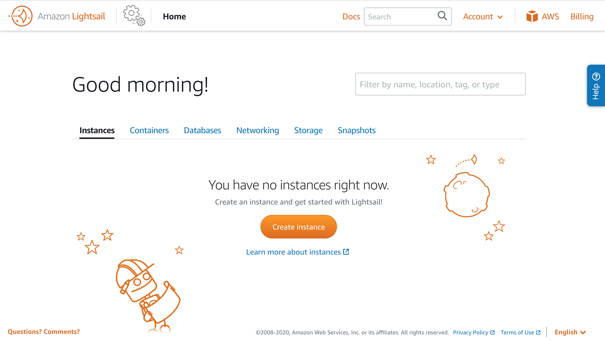

# 

The following is a quick start guide to getting a yourtube server stood up. Keep in mind that yourtube is **not** a production-ready service, and is intended a simply a toy server.

## Installing

### AWS & Amazon LightSail

Head on over to [Amazon Lightsail](https://aws.amazon.com/lightsail/). Note that you'll need to have an AWS account. You can use an existing Amazon account for access to AWS (more info [here](https://aws.amazon.com/premiumsupport/knowledge-center/create-and-activate-aws-account/)).

You should see something like the following:




### Creating an instance

Click 'Create Instance' and select 'Linux/Unix' as the platform. Set the blueprint to be 'OS Only' and select the latest Ubuntu variant.


Select the instance plan you'd like to use. **Important**: yourtube requires at least 1 GB of RAM. Name the instance 'yourtube-server' and click 'Create'.


Wait a couple of minutes while the instance boots up. You'll see something that looks like this:


Click on the instance name ('yourtube-server') to access the instance console.

### Setting up networking

A static IP address is required for the server. Click the 'Networking' tab in the console:


Click 'Create static IP', and select the name of the instance created earlier to attach to. Name the static IP 'yourtube-server-static-ip':


Back in the 'Networking' tab, scroll down to the 'IPv4 Firewall' section. Click '+ Add rule', and set the 'All protocols' rule. Your rules should look like this:


### Installing packages

Click the 'Connect' tab:


Clicking the 'Connect using SSH' button will open up a shell in the browser that connects you to the instance:


Type the following command, and press Enter:

```
sudo apt-get update
```

After that command completes, type the following, press Enter:

```
git clone https://github.com/yourtube-server/deploy.git
```

After that command completes, type the following, press Enter:

```
sudo chmod +x deploy/deploy_yourtube.sh
```
Finally, run the setup script:

```
sudo ./deploy/deploy_yourtube.sh
```

This should take a couple minutes to install all the necessary packages. 

### Deploying the Backend

Back in the console, copy the *Private IP* of the instance. In the following example, the Private IP is **172.26.12.145**


In the shell, enter the following command:

```
cd backend/
```

Then run this command:

```
sudo git pull
```

Then, enter the next command using the Private IP you copied:

```
sudo flask run -h <your private ip> 
```
Using the example screen shot, the command would be


```
sudo flask run -h 172.26.12.145 
```

You should see the message 'Running on http://\<your private ip\>:5000'

### Deploying the Frontend

Back in the console click on the 'Connect' tab, and open a separate shell by clicking on 'Connect using SSH' again:


In the new shell, enter the following:

```
cd frontend/
```

Then run this command:

```
sudo git pull
```

Then, enter this command:

```
sudo npm run dev
```

After a few seconds, you should see the message 'event - compiled successfully'

### Visit the app

To visit the web app, open a new tab and point your browser to the static ip running on port 3000. 

In the example screenshot, it's **http://3.221.201.182:3000/**

Bookmark this for easy access. Enjoy!


## Updating 

To update the app, reboot the instance, then repeat the directions for deploying the [backend](#deploying-the-backend) and then [frontend](#deploying-the-frontend).

## Migration

If you need to upgrade your instance (disk storage, RAM), take a snapshot of it, then create new instance with the snapshot image. On the upgraded instance, repeat the directions for deploying the [backend](#deploying-the-backend) and then [frontend](#deploying-the-frontend).


